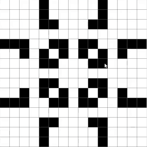

<!-- Index -->
# algorithm-nexus
Multiple algorithms I've wrote on top of my study routine, in order to help demonstrate or even solve different branches of general problems, using computer science.

<!-- Preview -->

    

 

<!-- Usage -->
# Usage
Reading the internal source code documentation is advised.
#### analyticDecompositionV.c
`$ gcc analyticDecompositionV.c -lm -oanalyticDecompositionV` 
`$ ./analyticDecompositionV compose 30 40` 
`$ ./analyticDecompositionV decompose 130 67.5` 
#### primeFactorDecomposition.c
`$ gcc primeFactorDecomposition.c -lm -oprimeFactorDecomposition` 
`$ ./primeFactorDecomposition 770` 
#### generateMegaSena.c
`$ gcc generateMegaSena.c -ogenerateMegaSena` 
`$ ./generateMegaSena 6 60` 
#### xor_swap.c
`$ gcc xor_swap.c -lm -oxor_swap` 
`$ ./xor_swap 8 80` 
#### bit_shift.cpp
`$ g++ bit_shift.cpp -obit_shift` 
`$ ./bit_shift`
<!-- #### ITA-escolha-de-especialidade.cpp
`$ g++ ITA-escolha-de-especialidade.cpp` 
`$ ./a.out`  -->
#### squareDigitSum.cpp
`$ g++ squareDigitSum.cpp -osquareDigitSum` 
`$ ./squareDigitSum` 
#### game.pde
Run [Processing](https://processing.org/download), open the source file and debug. Any `keyPressed` signal while window is `focused` should update the cellular automata.
#### euclidAlgorithm.cpp
`$ g++ -DEXTERN_XOR_SWAP euclidAlgorithm.cpp xor_swap.c -lm -oeuclidAlgorithm` 
`$ ./euclidAlgorithm 162 372` 
